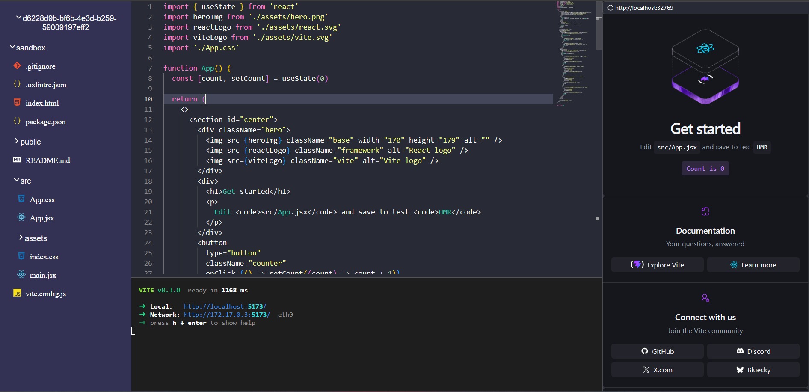

# 💻 Containerized-web-ide - Web-Based IDE

A highly interactive, browser-based integrated development environment (IDE) inspired by Replit. This project provides developers with an isolated, real-time coding workspace directly in their browser, complete with a fully functional terminal and rich code editing capabilities.

## 📖 About The Project

Containerized-web-ide is a fully functional Integrated Development Environment (IDE) that runs entirely in your browser. It allows developers to write, compile, and execute code in various languages without needing to install any local dependencies.

<!-- Add image photo.png -->


## ✨ Features

* **Multi-Language Support:** Compile and run code in Python, JavaScript, Java, C++, and more.

* **Integrated Terminal:** Run shell commands directly from the browser.

* **File System Management:** Create, delete, and organize files in a virtual workspace.

## 🛠️ Tech Stack

* **Frontend:** React.js / Vue.js, Tailwind CSS

* **Code Editor:** Monaco Editor (VS Code core)

* **Backend:** Node.js, Express

* **Code Execution Environment:** Docker (for isolated compilation/execution)

* **Database:** MongoDB / PostgreSQL (for user accounts and saved snippets)

* **WebSocket:** Socket.io (for real-time collaboration)

## 🚀 Getting Started

Follow these instructions to set up the project locally on your machine.

### Prerequisites

* [Node.js](https://nodejs.org/?utm_source=gemini) (v16 or higher)

* [Docker](https://www.docker.com/?utm_source=gemini) (Required for local code execution engines)

* [npm](https://www.npmjs.com/?utm_source=gemini) or [yarn](https://yarnpkg.com/?utm_source=gemini)

### Installation

1. **Clone the repository**

   ```
   git clone https://github.com/yourusername/your-web-ide.git
   cd your-web-ide
   
   ```

2. **Install dependencies for the server**

   ```
   cd server
   npm install
   
   ```

3. **Install dependencies for the client**

   ```
   cd ../client
   npm install
   
   ```

4. **Set up Environment Variables**
   Create a `.env` file in the `server` directory and add your configurations:

   ```
   PORT=3000
   DATABASE_URL=your_database_connection_string
   JWT_SECRET=your_secret_key
   
   ```

5. **Run the application**
   *Start the backend server:*

   ```
   cd server
   npm run dev
   
   ```

   *Start the frontend client:*

   ```
   cd client
   npm start
   
   ```

6. **Open your browser**
   Navigate to `http://localhost:3000` to see the IDE in action!
